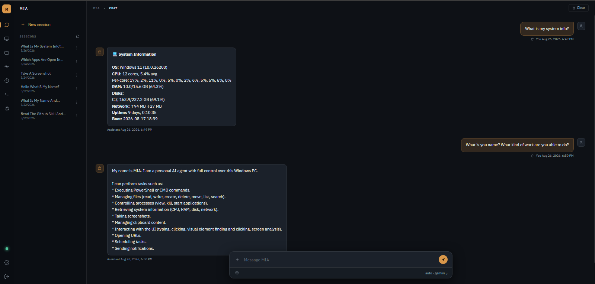
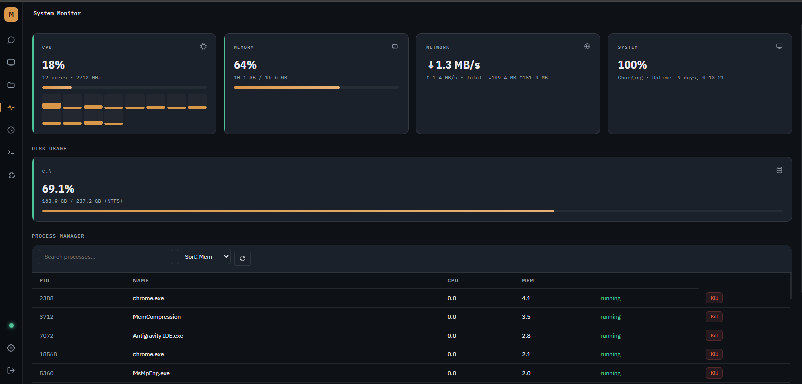

# M.I.A. — Multi-model Interactive Agentic-system

[](LICENSE)
[](https://www.python.org/downloads/)
[](#requirements)

MIA is a self-hosted AI agent that gives you full remote control of your Windows PC from anywhere — a premium web interface, backed by an agentic AI brain (hundreds of models via OpenRouter, or Claude, GPT, Gemini and local Ollama directly) with function calling, accessible over the internet via Cloudflare Tunnels.




## Features

- **Agentic AI Brain** — OpenRouter, Claude, GPT, Gemini or Ollama with function calling and a plugin-based tool system; switch models live
- **Self-improvement** — MIA can write and test its own new tools; its core stays read-only, every change is logged and can be undone, and deletions/sends need your approval
- **Skills** — drop-in `SKILL.md` capabilities the agent can read and use, installable/listable/removable from chat
- **Screen Streaming** — real-time remote desktop viewer with adjustable quality/scale, and full multi-monitor support
- **Remote Control** — mouse and keyboard control directly from the browser
- **File Manager** — browse, upload, download, and manage files remotely
- **System Monitor** — live CPU, RAM, disk, and network stats
- **Process Manager** — view, search, and kill running processes
- **Terminal** — interactive shell for raw command execution
- **Scheduled tasks & heartbeat** — "every weekday at 8am, summarize my email" in plain language, plus a periodic checklist that only alerts you when something matters
- **Telegram Channel** — talk to the same agent from Telegram
- **Auth** — password + JWT session authentication

## Architecture

- **Backend**: FastAPI (Python)
- **AI Core**: Google GenAI SDK / OpenAI SDK (agentic loop with streaming function calling)
- **Real-time**: WebSockets (screen stream, system stats, terminal, chat, notifications)
- **Screen Capture**: mss + OpenCV
- **Frontend**: Vanilla HTML/CSS/JS (zero-build SPA)
- **Connectivity**: Cloudflare Tunnels (`cloudflared`)

## Requirements

- Windows 10/11 (screen capture, input control, and process management use Windows APIs)
- Python 3.10+
- An AI model: an [OpenRouter](https://openrouter.ai/) account (one sign-in for Claude, GPT, Gemini and more), or a Claude, OpenAI or Gemini key, or a local [Ollama](https://ollama.com/) install — the setup wizard walks you through it

## Quick Start

1. Install with one line — open **PowerShell** and run:
   ```powershell
   irm https://raw.githubusercontent.com/darshanpatel4/MIA/main/install.ps1 | iex
   ```
   It finds (or installs) Python, downloads MIA to `%USERPROFILE%\MIA`, installs its dependencies in a private environment, adds a `mia` command, and starts the setup wizard (`mia onboard`): login password, AI model, Telegram (your user ID is detected automatically), remote access, and start-with-Windows. No admin rights needed. Run the same line again later to update.

   Already cloned the repo? Run `.\scripts\setup.ps1` from the project folder instead — same steps, using that folder.

2. Everyday commands:
   ```powershell
   mia start       # start MIA
   mia status      # check that everything is set up
   mia model       # change the AI model (or: mia model openrouter / claude / gpt / gemini / deepseek / ollama)
   mia onboard     # run the setup wizard again (keeps what you don't change)
   mia update      # update to the latest version
   ```
   **OpenRouter** is the easiest way to use many models: one sign-in (in your browser, no key to copy) gives MIA access to hundreds of models — Claude, GPT, Gemini, Llama, DeepSeek and more — and you can switch between them any time. Claude can also connect directly by signing in with your browser (Claude Console account, via Anthropic's `ant` CLI) or with an API key; GPT and Gemini use an API key. You can also switch models live in the web UI under **Settings → AI Models**.

3. Start MIA with `mia start` (the wizard also offers to start it for you). If you turned on remote access in the wizard, a Cloudflare Quick Tunnel prints a public URL (e.g. `https://something.trycloudflare.com`) you can open from your phone or another PC — no domain required. `mia start --tunnel` turns it on just for this run.

4. Open the printed URL (or `http://localhost:8765` if running locally) and log in with the password you set in the wizard.

## Configuration

Setup writes these to `.env` (see `.env.example` for the full list with comments):

| Variable | Purpose |
|---|---|
| `AI_PROVIDER` | `openrouter`, `anthropic`, `openai`, `gemini`, `deepseek`, or `ollama` |
| `OPENROUTER_API_KEY` / `OPENROUTER_MODEL` | OpenRouter key (saved automatically when you sign in) and model id, e.g. `anthropic/claude-opus-5` |
| `ANTHROPIC_API_KEY` / `OPENAI_API_KEY` / `GEMINI_API_KEY` / `DEEPSEEK_API_KEY` | API key for each provider |
| `ANTHROPIC_AUTH` | `api_key`, or `login` to use your browser sign-in (`ant auth login`) |
| `ANTHROPIC_MODEL` / `OPENAI_MODEL` / `GEMINI_MODEL` / `DEEPSEEK_MODEL` | Model to use for each provider (DeepSeek: `deepseek-flash` or `deepseek-v4-pro`) |
| `OLLAMA_BASE_URL` / `OLLAMA_MODEL` | Local Ollama endpoint and model, if used |
| `MIA_PASSWORD` | Login password |
| `JWT_SECRET` | Session signing secret (auto-generated) |
| `TELEGRAM_BOT_TOKEN` / `ALLOWED_TELEGRAM_USER_ID` | Optional Telegram channel |
| `SCREEN_FPS` / `SCREEN_QUALITY` | Screen stream tuning |

## Security Warning

**This application grants full administrative control over your PC to whoever holds a valid login token.**

- Never share your tunnel URL or login password.
- Use a strong, unique password — this is your only line of defense.
- For long-term/public deployment, put a custom domain behind Cloudflare Access (Zero Trust) for a second authentication layer (SSO, OTP, email auth) in front of MIA's own login.
- Treat `.env` as a secret file — it is already excluded via `.gitignore`, but never commit it or paste its contents anywhere.

## Contributing

Issues and pull requests are welcome. If you're adding a new agent tool, follow the existing pattern in `server/plugins/*.py`; if you're adding a skill, drop a `SKILL.md` under `data/skills/<name>/`.

## License

Apache License 2.0 — see [LICENSE](LICENSE).
